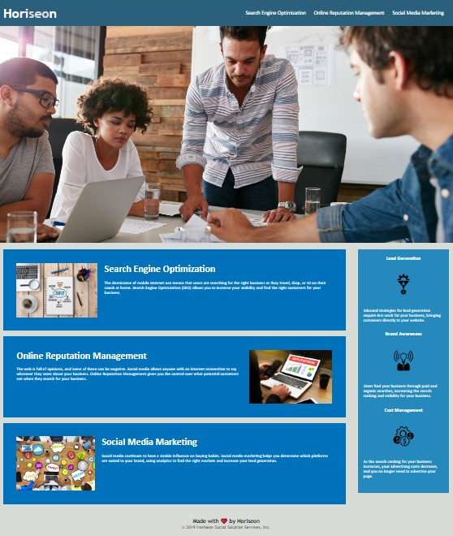

# 01 HTML, CSS, and Git: Code Refactor Challenge Week 1

## by Sophia De La Rosa

**User story:** "As a marketing agency, I want a codebase that follows accessibility standards so that our own site is optimized for search engines."

Description of product: Code is functioning and was refactored for better consolidation, organization and efficiency. Alt tags provided so the webpage meets accessibility standards. Comments added for clarity and ease of future updates.

Link to deployed application: https://sophiadelarosa.github.io/homework-week1/

## Mock-Up 

The following image shows the web application's appearance and functionality: 

